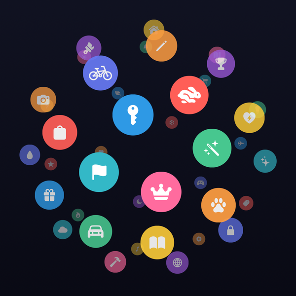
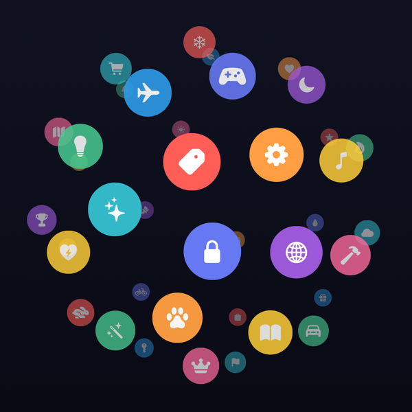
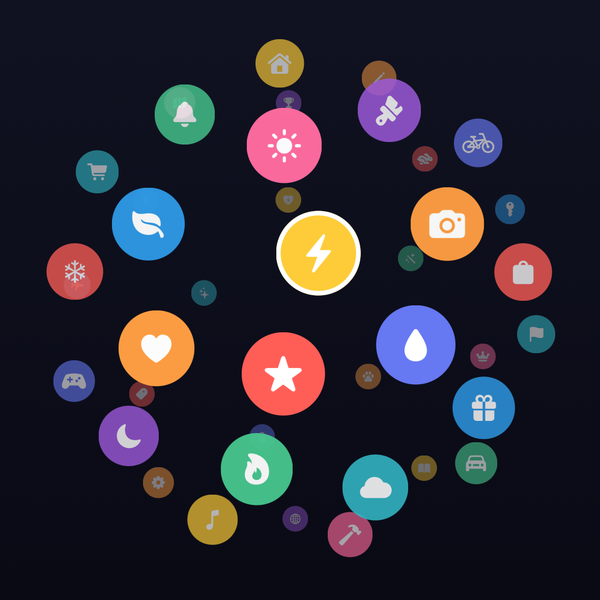
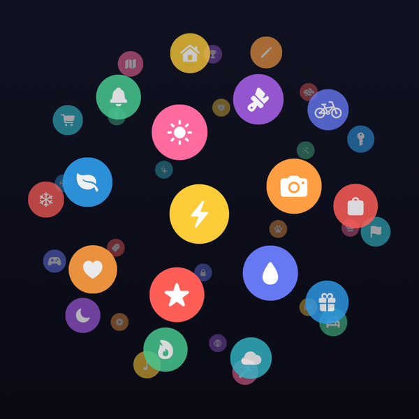
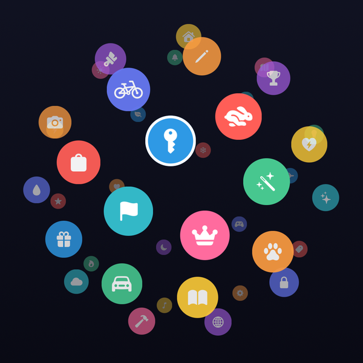
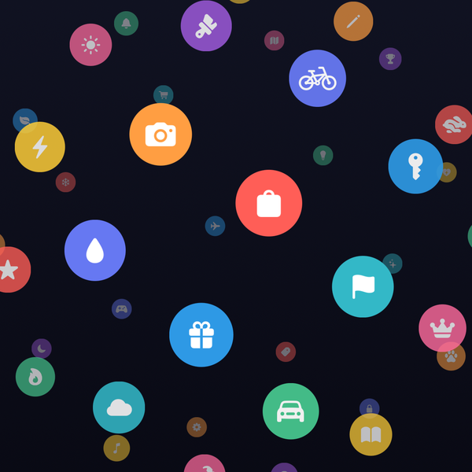
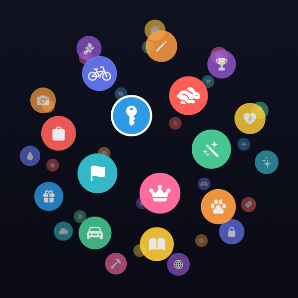

* TOC
{:toc}

---

## What is SphereView?

SphereView arranges any `UIView`s on the surface of a virtual sphere and makes the whole thing interactive: drag to spin it, flick it for momentum, pinch to zoom, and the frontmost item snaps into focus. The even, no-clumping distribution comes from a **Fibonacci lattice**; the 3D look is faked with nothing more than scale, alpha, and `zPosition`; and the rotation is a single quaternion, so it never gimbal-locks.

It's open-sourced at [github.com/DerNoah/swift-sphere-view](https://github.com/DerNoah/swift-sphere-view) (iOS 16+, Swift 6).

{:width="280"}
*A sphere of icon chips — front items are large and opaque, back items shrink and fade.*

<video src="spin.mp4" width="280" autoplay loop muted playsinline></video>
*The same sphere spinning. The lattice keeps the spacing even at every angle.*

Install it with Swift Package Manager:

```swift
dependencies: [
    .package(url: "https://github.com/DerNoah/swift-sphere-view", from: "1.0.0")
]
```

Then create the view and drop your items into its `contentView` — the gestures are wired up for you:

```swift
import SphereView

let sphere = SphereElementView(frame: CGRect(x: 0, y: 0, width: 320, height: 320))
view.addSubview(sphere)

for icon in icons {                 // any UIViews — chips, labels, images…
    sphere.contentView.addSubview(icon)
}
sphere.refreshLayout()              // lay them out on the sphere
```

---

## The Fibonacci sphere

The hard part of "put N points on a sphere" is doing it *evenly* — a naïve latitude/longitude grid clumps badly at the poles. The Fibonacci lattice avoids that by walking up the sphere in equal-area `z` steps while spinning the azimuth by the **golden angle** each step:

```swift
private func fibonacciSphere(numberOfPoints: Int) -> [(x: Double, y: Double, z: Double)] {
    let phi = (1.0 + sqrt(5.0)) / 2.0 // golden ratio
    var points = [(x: Double, y: Double, z: Double)]()

    for i in 0..<numberOfPoints {
        let iDouble = Double(i)
        let theta = acos(1 - 2 * (iDouble + 0.5) / Double(numberOfPoints))   // even z-bands
        let phi_i = 2 * Double.pi * (iDouble / phi).truncatingRemainder(dividingBy: 1)

        // Spherical coordinates to Cartesian
        let x = sin(theta) * cos(phi_i)
        let y = sin(theta) * sin(phi_i)
        let z = cos(theta)

        let rotated = globalRotation.act(simd_double3(x, y, z))   // apply the current rotation
        points.append((x: rotated.x, y: rotated.y, z: rotated.z))
    }
    return points
}
```

The `acos(1 - 2·(i+0.5)/N)` term spaces the points uniformly in `z` (equal-area horizontal bands), and the golden-angle azimuth keeps successive points maximally spread — no seams, no pole clustering. Each unit vector is then rotated by the sphere's current `globalRotation` quaternion, which is why the same function is called every time the view re-lays-out.

{:width="280"}
*Forty icons, evenly spaced — no clumping anywhere on the surface.*

<video src="rotate.mp4" width="280" autoplay loop muted playsinline></video>
*Tumbling the sphere shows the spacing stays even from every direction.*

---

## Faking depth

There's no SceneKit and no perspective division here — the projection is orthographic (x/y are just the point times the radius, centered). All the depth comes from three cheap per-item cues derived from `z`, where the **front of the sphere is `z = -1`**:

```swift
for (i, view) in subviews.reversed().enumerated() {
    let x = (spherePositions[i].x * sphereRadius) + contentView.bounds.width / 2
    let y = (spherePositions[i].y * sphereRadius) + contentView.bounds.height / 2
    let transformedZ = max((1 - CGFloat(spherePositions[i].z)) / 2, 0.3)  // 0.3 … 1.0

    view.center = CGPoint(x: x, y: y)
    view.transform = CGAffineTransform(scaleX: transformedZ, y: transformedZ) // front bigger
    view.alpha = transformedZ + 0.1                                           // back fainter
    view.layer.zPosition = transformedZ                                       // front on top
}
```

`transformedZ` maps the front item (`z = -1`) to `1.0` and the back (`z = +1`) to a floor of `0.3`. That single value drives the **scale** (front items render full-size, back items shrink to 30%), the **alpha** (back items fade out), and the **`zPosition`** (front items draw over the ones behind). Three lines, and a flat ring of views reads as a solid sphere.

{:width="280"}
*Scale + alpha + z-order: the front item is biggest and on top; the back ones shrink and fade.*

<video src="spin.mp4" width="280" autoplay loop muted playsinline></video>
*As an item rotates to the front it grows and sharpens; rotating away, it shrinks and fades.*

---

## Pan to rotate

Dragging spins the sphere by composing a quaternion from the pan deltas — quaternions compose cleanly and never gimbal-lock, so you can keep tumbling in any direction forever:

```swift
private func rotateSphereWithGlobalAxes(globalRotation: simd_quatd, deltaX: Double, deltaY: Double,
                                        sensitivity: Double = 0.01) -> simd_quatd {
    let rotationX = deltaY * sensitivity
    let rotationY = deltaX * sensitivity
    let quaternionX = simd_quaternion(rotationX, simd_double3(1, 0, 0))
    let quaternionY = simd_quaternion(rotationY, simd_double3(0, 1, 0))
    let newRotation = quaternionY * quaternionX           // rotate about the *global* axes
    return simd_normalize(newRotation * globalRotation)   // pre-multiply onto the running rotation
}
```

Each pan callback turns the horizontal/vertical drag into rotations about the global X and Y axes, *pre-multiplies* them onto the running `globalRotation`, and re-normalizes. Because the rotation lives in one quaternion (not Euler angles), there are no singularities — the controlling code just resets the gesture translation to zero each frame to avoid compounding the deltas.

{:width="280"}
*Drag in any direction to spin the sphere to a new orientation.*

<video src="rotate.mp4" width="280" autoplay loop muted playsinline></video>
*Free rotation about a tilted axis — no gimbal lock, no flipping.*

---

## Momentum & deceleration

Letting go after a flick doesn't stop the sphere dead — it keeps spinning and eases to rest using a scroll-view-style deceleration curve, run as an async `Task` at ~60 fps, and then snaps the nearest item to the front:

```swift
let decelerationRate = UIScrollView.DecelerationRate.fast.rawValue
let decelerationMultiplier = decelerationRate / 1.03
var currentVelocity = CGPoint(x: velocity.x / 100, y: velocity.y / 100)

currentDecelerationTask = Task { @MainActor in
    while abs(currentVelocity.x) > 0.1 || abs(currentVelocity.y) > 0.1 {
        try await Task.sleep(nanoseconds: 16_000_000)                 // ~16 ms / frame
        currentVelocity.x *= decelerationMultiplier
        currentVelocity.y *= decelerationMultiplier
        globalRotation = rotateSphereWithGlobalAxes(globalRotation: globalRotation,
                                                    deltaX: -Double(currentVelocity.x),
                                                    deltaY:  Double(currentVelocity.y))
        positionSubviews()
    }
    // …then snap the closest non-excluded item to front.
}
```

A flick only triggers momentum if the release velocity clears `decelerationTolerance` (default `80`); below that it snaps immediately. Each frame multiplies the velocity by the decay factor and applies the same quaternion rotation as a drag, so the spin-down feels continuous with the gesture.

{:width="280"}
*After a flick the sphere coasts, slows, and snaps the nearest item to the front (ringed).*

<video src="momentum.mp4" width="280" autoplay loop muted playsinline></video>
*Flick → coast → ease to rest → snap to the frontmost item.*

---

## Pinch to zoom

Zoom is the simplest piece: the pinch gesture writes straight to `sphereRadius`, and because that property re-lays-out on `didSet`, the sphere expands and contracts immediately:

```swift
open var sphereRadius: CGFloat { didSet { positionSubviews() } }

// in the pinch handler:
case .changed:
    sphereRadius = sender.scale * lastPinchScale
```

Growing the radius pushes the items apart (and, via `transformedZ`, exaggerates the depth); shrinking it pulls them into a tight cluster. You can drive it programmatically too — `resetZoom()` snaps back to the default radius, and `invalidateLayout()` computes a radius that fits the average item size into the bounds.

{:width="280"}
*Pinch out to spread the items; pinch in to cluster them.*

<video src="zoom.mp4" width="280" autoplay loop muted playsinline></video>
*Driving `sphereRadius` in and out — instant relayout, no animation code needed.*

---

## Front-item focus & tap-to-select

The view always tracks which non-excluded item is frontmost (smallest `z`) and fires `onFrontItemChanged` when it changes — handy for updating a caption or highlighting the current item. Tapping a front-hemisphere item toggles its `isSelected` (if it's a `UIControl`) and snaps it dead-center with a cubic-eased slerp:

```swift
sphere.onFrontItemChanged = {
    // the frontmost item changed — update your UI
}

sphere.snapToFrontItem()   // animate the nearest item to face the viewer

// Tag a view to keep it out of focus/snap (e.g. a center label):
backgroundLabel.tag = SphereElementView.excludedFromFocusTag
```

The snap is a 20-step interpolation between the current and target orientation (`simd_slerp` with an ease-out curve) that brings the chosen point to `z = -1`. Mark any decorative subview with `excludedFromFocusTag` and it's skipped by focus tracking, snapping, and tap hit-testing.

{:width="280"}
*The frontmost item is tracked continuously — here it's ringed as it faces the viewer.*

<video src="focus.mp4" width="280" autoplay loop muted playsinline></video>
*`onFrontItemChanged` keeps the ring on whichever item is currently at the front.*

---

## Tips

| Tip | Why |
|-----|-----|
| Add items to `contentView`, not the sphere | Subviews of `contentView` are what get laid out on the lattice |
| Call `refreshLayout()` after changing items | It re-runs the positioning; the view doesn't observe subview adds |
| Keep items uniformly sized | The depth cues (scale/alpha) read cleanest when every chip starts the same size |
| Use `excludedFromFocusTag` for chrome | A center label or backdrop stays put and out of focus/snap/hit-testing |
| Reach for `invalidateLayout()` to auto-fit | It picks a radius from the average item size so the sphere fills the bounds |
| Observe `onFrontItemChanged`, don't poll | It only fires when the frontmost item actually changes |
| Toggle `isScrollEnabled` / `isPinchEnabled` | Disable a gesture when you want a display-only or zoom-only sphere |

The full source is a single, dependency-free file on GitHub: [github.com/DerNoah/swift-sphere-view](https://github.com/DerNoah/swift-sphere-view).
