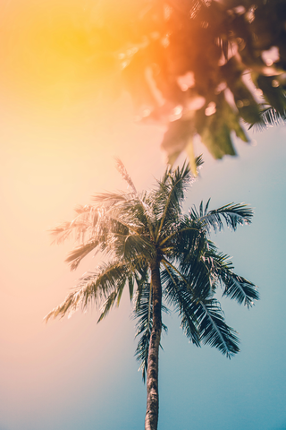
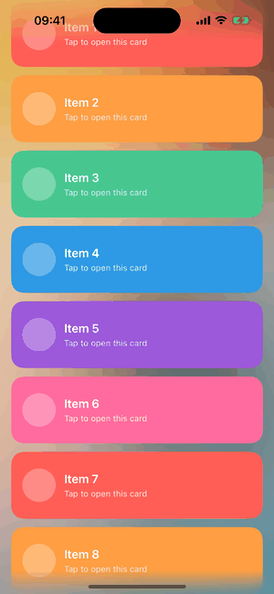
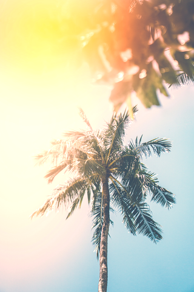
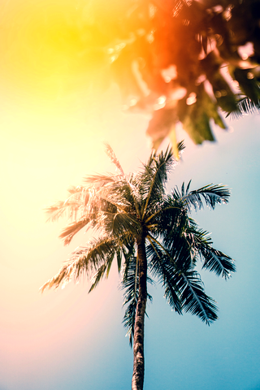
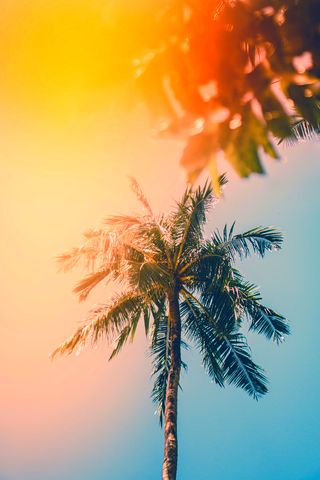
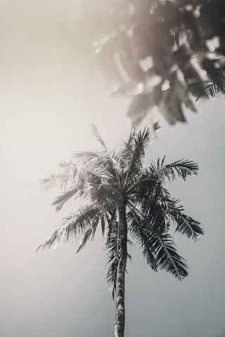
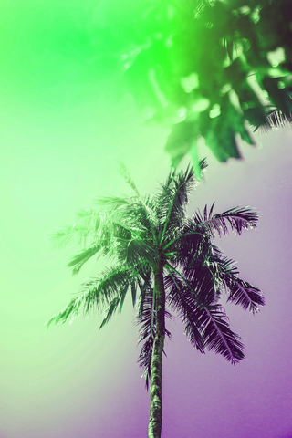
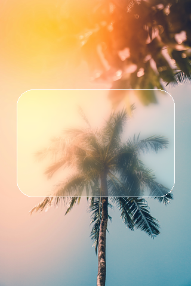
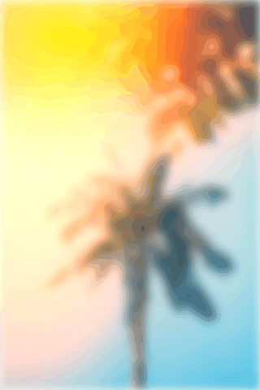
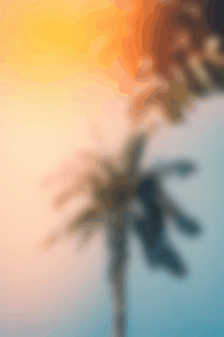

* TOC
{:toc}

---

## What is VisualEffect?

`UIVisualEffectView` gives you Apple's frosted-glass blur — but only at the fixed intensities Apple ships (`.systemThinMaterial`, `.regular`, and friends). There is no public `blurRadius` you can set to `3.7`, and no clean way to *animate* the blur from sharp to frosted and back. Every workaround people reach for (swapping effect styles, `UIViewPropertyAnimator` tricks, masking two snapshots) fights the framework.

**VisualEffect** takes a different route. It keeps the one thing only a real `UIVisualEffectView` can provide — the live backdrop capture of whatever is behind it — strips away Apple's fixed blur, and applies its own blur and colour adjustments under full animation control. You get a fully animatable, *variable* backdrop: seven effects (blur, brightness, contrast, saturation, grayscale, hue rotation, opacity), an implicit spring on every change, and a gesture-driven interactive API. You drive all of it from **UIKit or SwiftUI**.

Its headline use is a blur pinned to a scrolling edge — a frosted navigation or tab bar that blurs content moving behind it — which we'll build first.

It's open-sourced at [github.com/noahplutzer/swift-visual-effect](https://github.com/noahplutzer/swift-visual-effect) (iOS 17+, Swift 6, MIT).

{:width="280"}
*The backdrop we'll apply every effect to throughout this guide.*

Install it with Swift Package Manager:

```swift
dependencies: [
    .package(url: "https://github.com/noahplutzer/swift-visual-effect", from: "1.0.0")
]
```

```swift
import VisualEffect
```

---

## The core trick: an empty backdrop view

A `UIVisualEffectView`'s blur isn't drawn by you — it's a set of Core Animation filters Apple attaches to a private *backdrop layer* (the view's first sublayer), which continuously samples whatever sits behind the view. VisualEffect instantiates a normal blur view, then reaches into that layer and removes the filters, leaving the backdrop capture but none of Apple's processing:

```swift
public final class EmptyVisualEffectView: UIVisualEffectView {
    public init() {
        super.init(effect: UIBlurEffect(style: .systemUltraThinMaterial))
        removeAllFilters()
        registerForTraitChanges([UITraitUserInterfaceStyle.self]) { (self: Self, _) in
            DispatchQueue.main.async { self.removeAllFilters() }
        }
    }

    private func removeAllFilters() {
        if let filterLayer = layer.sublayers?.first {
            filterLayer.filters = []   // drop Apple's blur/tint, keep the backdrop pass
        }
    }
}
```

The trait-change handler re-strips the filters whenever the user switches light/dark mode, because the system reinstalls them at that point. (The re-strip is dispatched to the next main-thread tick so it runs *after* UIKit finishes putting them back.)

What's left is a neutral, transparent surface that still knows what's behind it — and crucially, that backdrop is captured **live, every frame.** SwiftUI's `.visualEffect { … }` modifier (new in iOS 17) then applies the package's own blur and colour filters on top, and **SwiftUI owns all the interpolation.** Your code never animates anything directly; it only sets values, and SwiftUI's animation engine tweens them.

That "live backdrop" property is the whole reason the next section works.

---

## The primary use case: a variable blur pinned to a scrolling edge

The single most common job for a blur view is a **frosted navigation or tab bar** — a strip pinned to a screen edge that blurs the content scrolling underneath it. Because VisualEffect's backdrop is captured live, the blur is *variable*: it re-samples whatever is behind the strip on every frame, so it stays frosted over an ever-changing background as the user scrolls.

{:width="280"}
*The bars stay pinned while the feed scrolls — each bar blurs whatever content is behind it at that moment, and the blur bleeds cleanly to the very screen edge.*

Two details make this work:

- **Use the backdrop view, not the content modifier.** There are two ways to apply effects with this library. The `.visualEffects(_:)` modifier (covered below) blurs a view's *own* content. To blur content *behind* a surface — which is what a bar over a scroll view needs — use the UIKit `VisualEffectView` or its SwiftUI wrapper `VisualEffectViewRepresentable`. Those host the live backdrop.
- **Negative `blurInsets` so the blur bleeds to the edge.** A Gaussian blur fades toward the boundary of its source surface, leaving a darkened rim. `blurInsets` grows the rendering surface past the view's bounds; with negative insets on the edge that meets the screen, the rim falls *outside* the visible strip and the blur reads solid right up to the notch or home indicator. (Leave `clippedBlur` at its default `false` so the surface is free to bleed.) The library's own example uses `UIEdgeInsets(top: -40, left: -40, bottom: -40, right: -40)`.

**UIKit** — pin two `VisualEffectView`s over a scroll view:

```swift
let scrollView = UIScrollView()
scrollView.frame = view.bounds
scrollView.autoresizingMask = [.flexibleWidth, .flexibleHeight]
view.addSubview(scrollView)            // tall content goes in here

// Frosted nav bar — negative TOP inset bleeds the blur up into the status bar / notch.
let navBar = VisualEffectView(
    blurInsets: UIEdgeInsets(top: -40, left: -40, bottom: 0, right: -40),
    initialValues: .blurredIn          // start frosted (blurRadius 6)
)
navBar.translatesAutoresizingMaskIntoConstraints = false
view.addSubview(navBar)                // sits above the scroll view

// Frosted tab bar — negative BOTTOM inset bleeds the blur down past the home indicator.
let tabBar = VisualEffectView(
    blurInsets: UIEdgeInsets(top: 0, left: -40, bottom: -40, right: -40),
    initialValues: .blurredIn
)
tabBar.translatesAutoresizingMaskIntoConstraints = false
view.addSubview(tabBar)

NSLayoutConstraint.activate([
    navBar.topAnchor.constraint(equalTo: view.topAnchor),
    navBar.leadingAnchor.constraint(equalTo: view.leadingAnchor),
    navBar.trailingAnchor.constraint(equalTo: view.trailingAnchor),
    navBar.bottomAnchor.constraint(equalTo: view.safeAreaLayoutGuide.topAnchor, constant: 44),

    tabBar.bottomAnchor.constraint(equalTo: view.bottomAnchor),
    tabBar.leadingAnchor.constraint(equalTo: view.leadingAnchor),
    tabBar.trailingAnchor.constraint(equalTo: view.trailingAnchor),
    tabBar.topAnchor.constraint(equalTo: view.safeAreaLayoutGuide.bottomAnchor, constant: -49),
])
```

**SwiftUI** — overlay the representable on each edge of a `ScrollView`:

```swift
ScrollView {
    LazyVStack(spacing: 12) { /* your feed */ }
}
.overlay(alignment: .top) {
    VisualEffectViewRepresentable(
        blurInsets: UIEdgeInsets(top: -40, left: -40, bottom: 0, right: -40),
        initialValues: .blurredIn
    )
    .frame(height: 100)
    .ignoresSafeArea(edges: .top)
}
.overlay(alignment: .bottom) {
    VisualEffectViewRepresentable(
        blurInsets: UIEdgeInsets(top: 0, left: -40, bottom: -40, right: -40),
        initialValues: .blurredIn
    )
    .frame(height: 88)
    .ignoresSafeArea(edges: .bottom)
}
```

Because each bar holds a `VisualEffectState`, you can animate it like anything else — fade the bars' blur in as the user starts scrolling, for instance — using the techniques in the rest of this guide.

---

## Basic usage in SwiftUI

To blur a view's *own* content (rather than a backdrop behind it), wrap it with the `.visualEffects(_:)` modifier and drive a single observable state object:

```swift
import SwiftUI
import VisualEffect

struct GalleryView: View {
    @State private var effect = VisualEffectState()

    var body: some View {
        PhotoGrid()
            .visualEffects(effect)          // apply the effect to this view
            .onTapGesture {
                effect.values = .blurredIn  // blur the whole grid
            }
    }
}
```

`VisualEffectState` is an `@Observable` class that holds a `VisualEffectValues` struct — the full set of animatable parameters. Each one has a neutral default, so `VisualEffectValues()` renders nothing at all:

```swift
public struct VisualEffectValues {
    public var blurRadius: CGFloat   // 0  = no change
    public var brightness: CGFloat   // 0  = no change (additive)
    public var contrast: CGFloat     // 1  = no change
    public var saturation: CGFloat   // 1  = no change  (0 = greyscale)
    public var grayscale: CGFloat    // 0  = no change  (1 = fully grey)
    public var hueRotation: CGFloat  // degrees, 0 = no change
    public var opacity: CGFloat      // 1  = opaque
}
```

Set them individually or all at once:

```swift
effect.values.blurRadius = 6
effect.values = VisualEffectValues(blurRadius: 6, saturation: 1.4)
```

The next section walks each parameter on its own.

---

## The seven effects

Each effect below is one field on `VisualEffectValues`. The images show each applied in isolation to the photo above.

**Blur** — `blurRadius` is a Gaussian blur radius in points. This is the headline effect and the basis of the `.blurredIn` preset (radius `6`):

```swift
effect.values.blurRadius = 6
```

{:width="280"}
*`blurRadius: 6` — the frosted backdrop.*

**Brightness** — additive, in normalized 0–1 space. `0` leaves the image unchanged; positive values lift every channel toward white:

```swift
effect.values.brightness = 0.18
```

{:width="280"}
*`brightness: 0.18` — every channel lifted; highlights bloom toward white.*

**Contrast** — a multiplier around mid-grey. `1` is unchanged; above `1` pushes lights lighter and darks darker:

```swift
effect.values.contrast = 1.4
```

{:width="280"}
*`contrast: 1.4` — tones pulled apart around the midpoint.*

**Saturation** — `1` is unchanged, `0` is fully greyscale, and above `1` is more vivid:

```swift
effect.values.saturation = 1.8
```

{:width="280"}
*`saturation: 1.8` — richer, more vivid colour.*

**Grayscale** — a blend toward luminance. `0` is unchanged, `1` is fully grey. Unlike `saturation: 0`, it's a *partial* desaturation you can dial:

```swift
effect.values.grayscale = 0.85
```

{:width="280"}
*`grayscale: 0.85` — mostly grey, a hint of colour remaining.*

**Hue rotation** — rotates every colour around the wheel, in degrees. A large value is dramatic; small values tint subtly:

```swift
effect.values.hueRotation = 90
```

{:width="280"}
*`hueRotation: 90` — every hue shifted a quarter-turn around the colour wheel.*

**Opacity** — `1` is opaque; below that, the surface becomes translucent and the sharp content behind it shows through. It only reads against a background, so here it's shown as a frosted card laid over the photo:

```swift
effect.values.opacity = 0.75
```

{:width="280"}
*`opacity: 0.75` — the frosted panel goes translucent and the sharp photo bleeds through.*

---

## Composing a frosted-glass surface

The real use case combines a few of these into a single panel — a blurred backdrop, a touch of brightness to give the glass some lift, and a little extra saturation so colour doesn't wash out:

```swift
effect.values = VisualEffectValues(
    blurRadius: 6,
    brightness: 0.10,
    saturation: 1.4
)
```

{:width="280"}
*Blur + brightness + saturation, clipped to a rounded card — the canonical frosted panel.*

Two knobs control how the blur meets the edges of the surface:

- **`clippedBlur`** (default `false`). When `false`, the rendered blur is allowed to bleed slightly past the view's bounds — the layer's content is expanded with negative padding so the frosted edge looks soft rather than cut off (this is what the pinned bars above rely on). Set it to `true` to clip the effect crisply to the bounds, which is what you want for a card with hard rounded corners.
- **`blurInsets`** (on the UIKit `VisualEffectView`). Insets — typically negative — applied to the rendering surface so the blur samples a little beyond the view's frame, avoiding a darkened rim at the edges.

```swift
effect.clippedBlur = true
```

---

## Animating the effect

Here's the payoff of letting SwiftUI own the rendering: **you never write an animation.** The effect layer attaches an implicit spring keyed on the value struct, so *any* assignment to `values` animates automatically:

```swift
// internally, the layer applies:
//   .animation(.spring(duration: state.animationDuration, bounce: 0.1), value: values)

effect.animationDuration = 0.45      // tune the spring (default 0.45)
effect.values = .blurredIn           // sharp → frosted, spring-animated
```

Two presets bookend the common case:

```swift
public static let blurredIn  = VisualEffectValues(blurRadius: 6)   // frosted
public static let blurredOut = VisualEffectValues()               // neutral / clear
```

{:width="280"}
*Assigning `.blurredIn` springs the blur from 0 to 6 — note the slight overshoot before it settles.*

---

## Interactive dismissal with `fractionComplete`

The spring is perfect for taps, but image viewers need the blur to track a finger. For that, `VisualEffectView` exposes a `UIViewPropertyAnimator`-style scrubbing API — except there's no animator, just SwiftUI values you set directly.

```swift
let effectView = VisualEffectView()
effectView.frame = view.bounds
view.addSubview(effectView)

effectView.blurIn()   // animate to .blurredIn to start
```

A pan gesture then drives the dismissal:

```swift
@objc func handlePan(_ gesture: UIPanGestureRecognizer) {
    let translation = gesture.translation(in: view).y
    let progress = min(1, max(0, translation / 200))   // drag 200pt = fully clear

    switch gesture.state {
    case .began:
        effectView.beginInteractive()              // snapshot the current values
    case .changed:
        effectView.fractionComplete = progress     // 0 = full blur, 1 = none
    case .ended, .cancelled:
        effectView.pauseInteractive()              // commit the current frame
        if progress > 0.4 {
            effectView.finishInteractive()         // ease out to .blurredOut
        } else {
            effectView.cancelInteractive()         // spring back to the snapshot
        }
    default:
        break
    }
}
```

What each call does:

- **`beginInteractive()`** snapshots the current values as the "full blur" endpoint and cancels any in-flight spring, pinning the surface exactly where it is.
- **`fractionComplete`** (`0` = full blur, `1` = no blur) is written every frame of the pan with *no* animation, so it follows the finger instantly. It interpolates from the snapshot toward neutral — `blurRadius`, `brightness`, and `saturation` all ease out together:

  ```
  blurRadius = start.blurRadius * (1 - p)
  brightness = start.brightness * (1 - p)
  saturation = 1 + (start.saturation - 1) * (1 - p)
  ```

- **`pauseInteractive()`** forces a synchronous render (`layoutIfNeeded()`) so the animation you start next begins from exactly where the gesture left off — the SwiftUI equivalent of `UIViewPropertyAnimator.pauseAnimation()`.
- **`finishInteractive()`** eases the rest of the way out to `.blurredOut` (a commit).
- **`cancelInteractive()`** springs back to the snapshot (an abort).

{:width="280"}
*Driving `fractionComplete` from 0 to 1 and back — blur, brightness, and saturation interpolate together as the value scrubs.*

---

## `blurOverridesOpacity`: dismiss without a hard frame

There's a subtle problem with animating a blur all the way to zero: at radius `0` you'd briefly show a perfectly *sharp* frame before the view is removed — a visible pop. VisualEffect avoids it with the `blurOverridesOpacity` flag (default `true`), which clamps the rendered blur and fades the surface out instead:

```
effectiveBlur  = max(1, blurRadius)   // never render a fully-sharp pass-through
derivedOpacity = min(1, blurRadius)   // below radius 1, fade out via opacity
```

So as `blurRadius` drops from `1` to `0`, the surface stays blurred at radius `1` while its opacity falls to zero — it dissolves over the sharp content beneath rather than snapping into focus.

{:width="280"}
*With `blurOverridesOpacity`, the frosted layer fades away below radius 1 — no sharp flash on dismissal.*

---

## UIKit usage

You don't need SwiftUI to use VisualEffect. `VisualEffectView` is a plain `UIView` you can drop into any view controller; under the hood it hosts the SwiftUI effect layer for you. It plays nicely with `UIView.animate`, because the convenience setters just write to the underlying state and SwiftUI tweens the result:

```swift
let effectView = VisualEffectView(blurInsets: .zero, initialValues: .blurredOut)
effectView.frame = view.bounds
view.addSubview(effectView)

UIView.animate(withDuration: 0.4) {
    effectView.blurRadius = 10        // animates via the implicit spring
}
```

`blurRadius`, `saturation`, and `brightness` have direct properties; for the rest, set the whole struct through `effectValues`:

```swift
effectView.effectValues = VisualEffectValues(blurRadius: 6, grayscale: 0.4, hueRotation: 20)
```

---

## Tips

| Tip | Why |
|-----|-----|
| Pin bars with the *backdrop* view, not `.visualEffects` | `VisualEffectView` / `VisualEffectViewRepresentable` blur what's behind them; `.visualEffects(_:)` blurs the view's own content |
| Use negative `blurInsets` on the pinned edge | The blurred surface bleeds past the bounds so it reads solid to the notch/home indicator, with no darkened rim |
| Keep one `VisualEffectState` per surface | It's the single source of truth the effect layer observes; share it between your UIKit/SwiftUI code and gesture handlers |
| Let SwiftUI own the interpolation | Never wrap value changes in your own animator — assign `values` and the implicit spring handles it |
| Prefer `blurOverridesOpacity` for dismissals | It fades the surface out below radius 1 instead of flashing a sharp frame |
| Call `beginInteractive()` before scrubbing | It snapshots the endpoint `fractionComplete` interpolates from; without it the scrub has nothing to interpolate against |
| `pauseInteractive()` between gesture and animation | Commits the current frame so `finishInteractive()`/`cancelInteractive()` start from where the finger left off |
| Tune `animationDuration`, not the curve | One knob controls the implicit spring's duration; the bounce is fixed at a gentle `0.1` |

The full source — and a deeper look at how the SwiftUI layer is wired to the stripped-down backdrop view — is on GitHub: [github.com/noahplutzer/swift-visual-effect](https://github.com/noahplutzer/swift-visual-effect).
